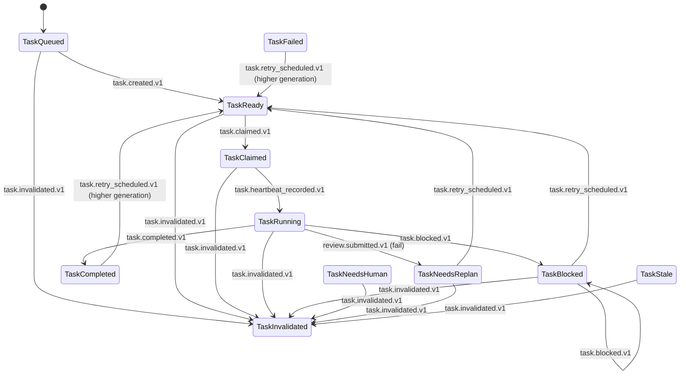
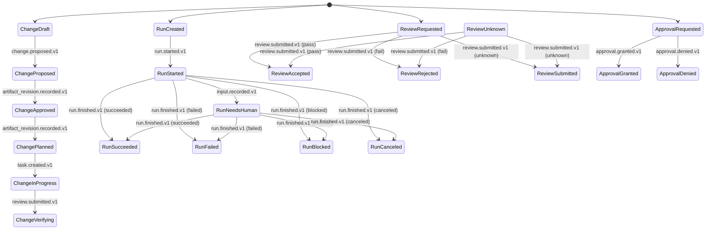
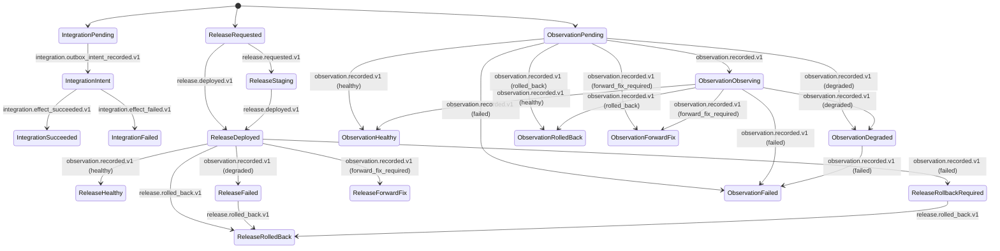

# P01-T07 State Diagrams

Generated from the exported transition matrices in `packages/core/src/state-machines/index.ts`.

```mermaid
stateDiagram-v2
  [*] --> TaskQueued
  TaskQueued --> TaskReady: task.created.v1
  TaskReady --> TaskClaimed: task.claimed.v1
  TaskClaimed --> TaskRunning: task.heartbeat_recorded.v1
  TaskRunning --> TaskBlocked: task.blocked.v1
  TaskRunning --> TaskCompleted: task.completed.v1
  TaskRunning --> TaskNeedsReplan: review.submitted.v1 (fail)
  TaskBlocked --> TaskBlocked: task.blocked.v1
  TaskBlocked --> TaskReady: task.retry_scheduled.v1
  TaskNeedsReplan --> TaskReady: task.retry_scheduled.v1
  TaskCompleted --> TaskReady: task.retry_scheduled.v1 (higher generation)
  TaskFailed --> TaskReady: task.retry_scheduled.v1 (higher generation)
  TaskQueued --> TaskInvalidated: task.invalidated.v1
  TaskReady --> TaskInvalidated: task.invalidated.v1
  TaskClaimed --> TaskInvalidated: task.invalidated.v1
  TaskRunning --> TaskInvalidated: task.invalidated.v1
  TaskBlocked --> TaskInvalidated: task.invalidated.v1
  TaskNeedsHuman --> TaskInvalidated: task.invalidated.v1
  TaskNeedsReplan --> TaskInvalidated: task.invalidated.v1
  TaskStale --> TaskInvalidated: task.invalidated.v1
```

```mermaid
stateDiagram-v2
  [*] --> ChangeDraft
  ChangeDraft --> ChangeProposed: change.proposed.v1
  ChangeProposed --> ChangeApproved: artifact_revision.recorded.v1
  ChangeApproved --> ChangePlanned: artifact_revision.recorded.v1
  ChangePlanned --> ChangeInProgress: task.created.v1
  ChangeInProgress --> ChangeVerifying: review.submitted.v1

  [*] --> RunCreated
  RunCreated --> RunStarted: run.started.v1
  RunStarted --> RunSucceeded: run.finished.v1 (succeeded)
  RunStarted --> RunFailed: run.finished.v1 (failed)
  RunStarted --> RunBlocked: run.finished.v1 (blocked)
  RunStarted --> RunCanceled: run.finished.v1 (canceled)
  RunStarted --> RunNeedsHuman: input.recorded.v1
  RunNeedsHuman --> RunSucceeded: run.finished.v1 (succeeded)
  RunNeedsHuman --> RunFailed: run.finished.v1 (failed)
  RunNeedsHuman --> RunBlocked: run.finished.v1 (blocked)
  RunNeedsHuman --> RunCanceled: run.finished.v1 (canceled)

  [*] --> ReviewRequested
  ReviewRequested --> ReviewAccepted: review.submitted.v1 (pass)
  ReviewRequested --> ReviewRejected: review.submitted.v1 (fail)
  ReviewRequested --> ReviewSubmitted: review.submitted.v1 (unknown)
  ReviewUnknown --> ReviewAccepted: review.submitted.v1 (pass)
  ReviewUnknown --> ReviewRejected: review.submitted.v1 (fail)
  ReviewUnknown --> ReviewSubmitted: review.submitted.v1 (unknown)

  [*] --> ApprovalRequested
  ApprovalRequested --> ApprovalGranted: approval.granted.v1
  ApprovalRequested --> ApprovalDenied: approval.denied.v1
```

```mermaid
stateDiagram-v2
  [*] --> IntegrationPending
  IntegrationPending --> IntegrationIntent: integration.outbox_intent_recorded.v1
  IntegrationIntent --> IntegrationSucceeded: integration.effect_succeeded.v1
  IntegrationIntent --> IntegrationFailed: integration.effect_failed.v1

  [*] --> ReleaseRequested
  ReleaseRequested --> ReleaseStaging: release.requested.v1
  ReleaseRequested --> ReleaseDeployed: release.deployed.v1
  ReleaseStaging --> ReleaseDeployed: release.deployed.v1
  ReleaseDeployed --> ReleaseHealthy: observation.recorded.v1 (healthy)
  ReleaseDeployed --> ReleaseFailed: observation.recorded.v1 (degraded)
  ReleaseDeployed --> ReleaseRollbackRequired: observation.recorded.v1 (failed)
  ReleaseDeployed --> ReleaseForwardFix: observation.recorded.v1 (forward_fix_required)
  ReleaseDeployed --> ReleaseRolledBack: release.rolled_back.v1
  ReleaseFailed --> ReleaseRolledBack: release.rolled_back.v1
  ReleaseRollbackRequired --> ReleaseRolledBack: release.rolled_back.v1

  [*] --> ObservationPending
  ObservationPending --> ObservationObserving: observation.recorded.v1
  ObservationPending --> ObservationHealthy: observation.recorded.v1 (healthy)
  ObservationPending --> ObservationDegraded: observation.recorded.v1 (degraded)
  ObservationPending --> ObservationFailed: observation.recorded.v1 (failed)
  ObservationPending --> ObservationRolledBack: observation.recorded.v1 (rolled_back)
  ObservationPending --> ObservationForwardFix: observation.recorded.v1 (forward_fix_required)
  ObservationObserving --> ObservationHealthy: observation.recorded.v1 (healthy)
  ObservationObserving --> ObservationDegraded: observation.recorded.v1 (degraded)
  ObservationObserving --> ObservationFailed: observation.recorded.v1 (failed)
  ObservationObserving --> ObservationRolledBack: observation.recorded.v1 (rolled_back)
  ObservationObserving --> ObservationForwardFix: observation.recorded.v1 (forward_fix_required)
  ObservationDegraded --> ObservationFailed: observation.recorded.v1 (failed)
```
