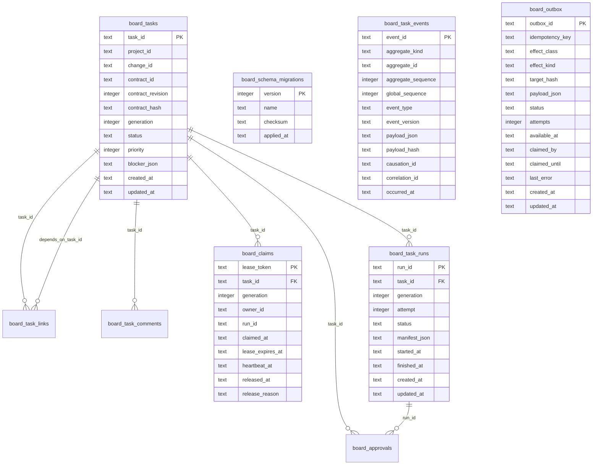

# P03-T01 Board Schema Diagram

Source schema: `schemas/sqlite/board-schema-v1.sql`
Provider package: `packages/store-sqlite`

Ownership notes:

- `@legion/board-store` owns provider-neutral table/index diagnostics and board store contracts.
- `@legion/store-sqlite` owns concrete SQLite pragmas, SQL statements, migrations, transaction rollback, and real-file diagnostics.
- `.legion/var/board.sqlite` is mutable operational state. Git-tracked artifacts remain under `.legion/project`.
